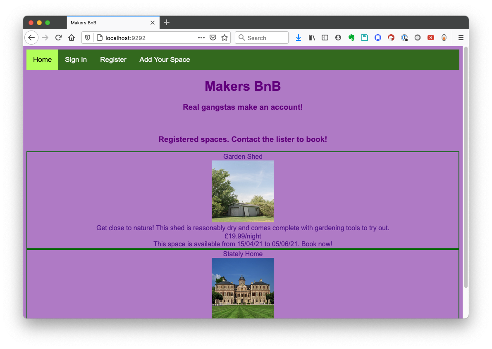
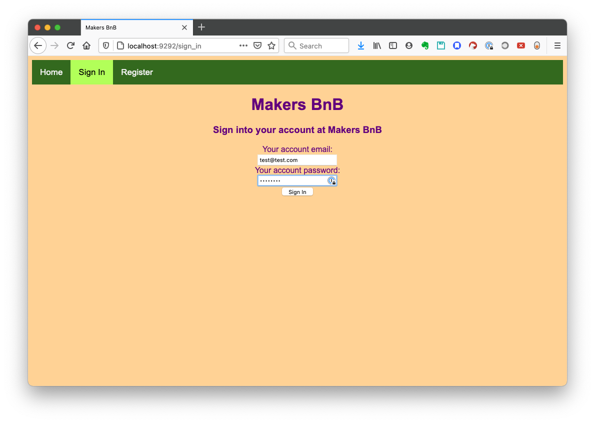
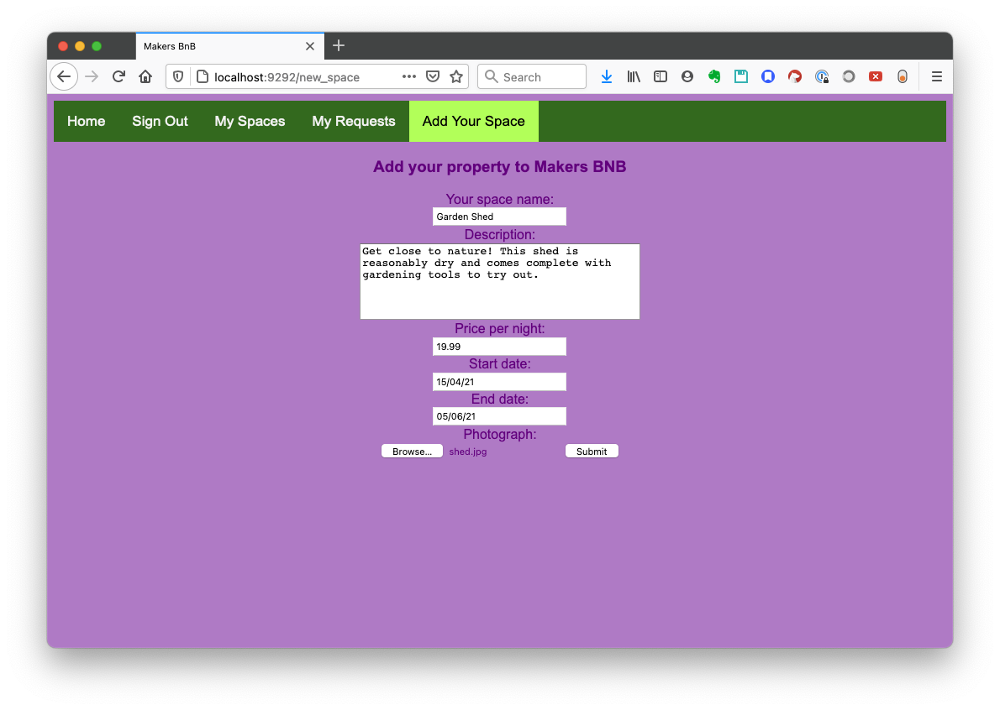
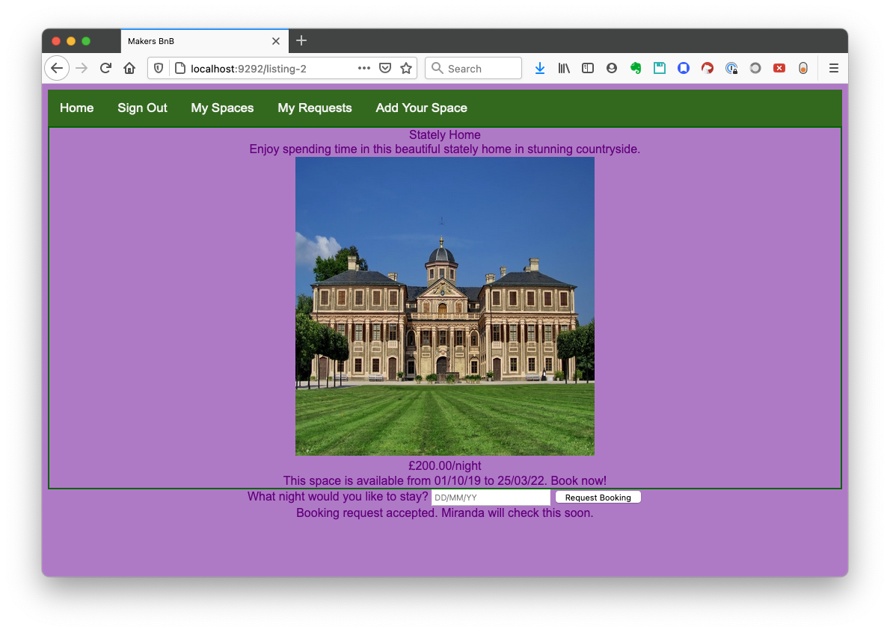
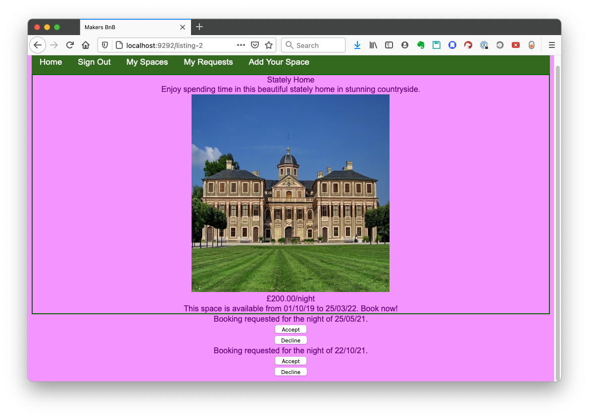

## MakersBNB Challenge

An Airbnb-style accommodation listings site.

[Description](#description)  
[Technical Approach](#technical-approach)  
[Development Team](#development-team)  
[Installation and Usage](#installation-and-usage)  
[Known Issues](#known-issues)  


### Description
This was a group project for week 5 of the 12-week [Makers Academy](https://makers.tech) coding bootcamp. The goal was to create our take on an Airbnb clone, using the Ruby web framework Sinatra. We were given these user stories:  

```
As a user,
So that I can list my house,
I’d like to be able to create a listing of a space.
```
```
As a user,
So that I can make money from all of my properties,
I would like to be able to list multiple spaces.
```
```
As a user,
So that other users can admire my space and want to stay there,
I want to be able to provide a name, description and price for my space.
```
```
As a user,
So that other users can consider when they might be able to visit,
I want to be able to offer a range of dates when the space is unoccupied.
```
```
As a user,
So I can rent a space,
I’d like to be able to request a space and it to be approved by the owner.
```
```
As a user,
So that I don’t get double-booked,
I want to make sure that a space can’t be booked more than once.
```
```
As a user,
So that my space is still available to other prospective clients,
I would like my space to not be booked out until a user confirms a booking request.
```
  
We were able to complete all of these specifications to some level. Our planning can be found [here](planning.md).

The app looks like this:  
<figure style="margin: auto">
<figcaption>Arriving at the homepage. The listed spaces are shown, but can't be booked.</figcaption>

</figure><br>

<figure style="margin: auto">
<figcaption>A registered user signing in.</figcaption>

</figure><br>

<figure style="margin: auto">
<figcaption>Listing a new space.</figcaption>

</figure><br>

<figure style="margin: auto">
<figcaption>Requested to book a night here, in this space owned by a different user.</figcaption>

</figure><br>

<figure style="margin: auto">
<figcaption>The space's owner can see that two bookings have been requested, and confirm or decline them.</figcaption>

</figure><br>


### Technical Approach
We used the Ruby web framework Sinatra for this project, in a Model View Controller pattern. Following instructions that I had [written](http://www.mirandawilson.tech/blog/2021/02/01/walkthrough-chitter-orm/) on my blog, we took advantage of the gem version of ActiveRecord - usually part of Rails - to simplify our database management and CRUD activities. It's an [Object Relational Mapper](https://blog.bitsrc.io/what-is-an-orm-and-why-you-should-use-it-b2b6f75f5e2a), which provides a layer between Sinatra and the SQL database, and provides boilerplate functionality.  

Our model classes are User, Space and Booking. Each of them inherits from `ActiveRecord::Base`, which provides standard functionality for creating new records in the database, deleting records, and finding specific entries.  

We used the gem BCrypt to encrypt passwords. No passwords are shown in plain text.  

Tests are written in Rspec with Capybara for feature testing.  

### Development Team
[Me](https://github.com/mscwilson)  
[Hamish Arro](https://github.com/HamishArro/)  
[Josh Sinyor](https://github.com/JoshSinyor/)  
[Richard Turney](https://github.com/RTurney/)  

### Installation and Usage  
Make sure that Ruby 3.0.0 is installed, as well as Bundler.
* Clone the repo
* Navigate into the cloned folder
* Run `bundle` to install the required gems
* Create the databases: 
    ```
    rake db:create
    rake db:create RACK_ENV=test
    ```
* Generate the correct tables in the databases:
    ```
    rake db:schema:load
    rake db:schema:load RACK_ENV=test
    ```
* Run the app: `rackup`
* Go to `localhost:9292` to view the app

* To run the tests, `rspec`


Some users experience an error during the `bundle install` process owing to difficulties installing dependencies of `thin`.
  - To correct this error, run command `gem install thin -v '1.6.4' -- --with-cflags="-Wno-error=implicit-function-declaration"` to install version 1.6.4.  
  - Then run command `gem install thin` to install the current version of `thin`.
  - Then run command `gem uninstall thin`, and choose to uninstall version 1.6.4 with command `1`.
  - Resume the `bundle` process.

### Known Issues
* There are no checks that entered dates are valid dates.
* Uploaded images are stored locally, and the database only contains a string for their path. It would be better to use ActiveStorage, the image-focussed counterpart to ActiveRecord, to store the images properly in the database.

